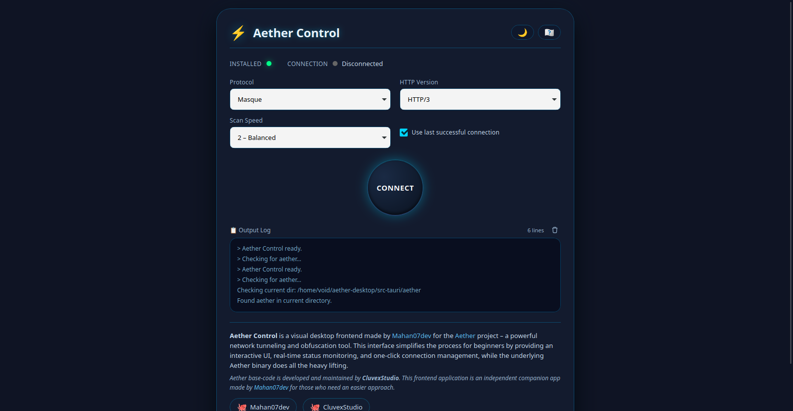

# ⚡ Aether Control

**Aether Control** is a visual, beginner‑friendly desktop frontend for [Aether](https://github.com/CluvexStudio/Aether) – a powerful network tunneling and obfuscation tool. It provides a clean, interactive UI to start/stop Aether tunnels, monitor connection status, and view real‑time logs – all without touching the command line.



---

## ✨ Features

- **One‑click connect/disconnect** – no terminal commands needed.
- **Real‑time status** – shows if Aether is installed, connected, or disconnected.
- **Configurable options** – choose protocol (Masque/WireGuard/Warp‑in‑Warp), HTTP version, scan speed, and reconnect behaviour.
- **V2Ray integration guide** – when connected, displays your SOCKS5 proxy address and a ready‑to‑use `config.json`.
- **Bilingual interface** – English and Farsi (Persian) with RTL support.
- **Dark / Light theme** – adapts to your preference.
- **Live log viewer** – see Aether’s output and errors in real time.

---

## 🚀 Installation

### Download the installer for your platform

- **Linux** – `.deb` (Debian/Ubuntu) or `.AppImage` (universal)
- **Windows** – `.msi` or `.exe` (NSIS installer)
- **macOS** – `.dmg`

> You can find all releases on the [Releases page](https://github.com/yourusername/yourrepo/releases).

### Prepare the Aether binary

Aether Control requires the **`aether` binary** to be placed in a folder named `aether` **in the same directory as the application** (or next to the executable).  
Download the appropriate Aether binary for your OS from the [original Aether repository](https://github.com/CluvexStudio/Aether/releases) and extract it into the `aether/` folder.

> The app will automatically check the current working directory and the executable directory for the `aether` folder.

---

## 🧱 Build from Source

### Prerequisites

- [Rust](https://rustup.rs/) installed.
- [Tauri CLI](https://tauri.app/v1/guides/getting-started/prerequisites) (install with `cargo install tauri-cli`).
- Platform‑specific dependencies (see [Tauri docs](https://tauri.app/v1/guides/getting-started/prerequisites)).

### Clone and build

```bash
git clone https://github.com/yourusername/yourrepo.git
cd yourrepo
cargo tauri build
```
The installers will be placed in src-tauri/target/release/bundle/.

---

## 🧑‍💻 Credits

- **Aether** – developed and maintained by [CluvexStudio](https://github.com/CluvexStudio/Aether). All the network‑tunneling intelligence comes from their work.
- **Aether Control** – frontend UI and integration built with ❤️ by [Mahan07dev](https://github.com/mahan07dev).

---

## 📄 License
This project is licensed under the MIT License – see the LICENSE file for details.

---

## 🤝 Contributing
Contributions, issues and feature requests are welcome!
Feel free to check the issues page.

---

## 📸 Screenshot
https://screenshot.png

---

Enjoy a simpler way to use Aether! ⚡
